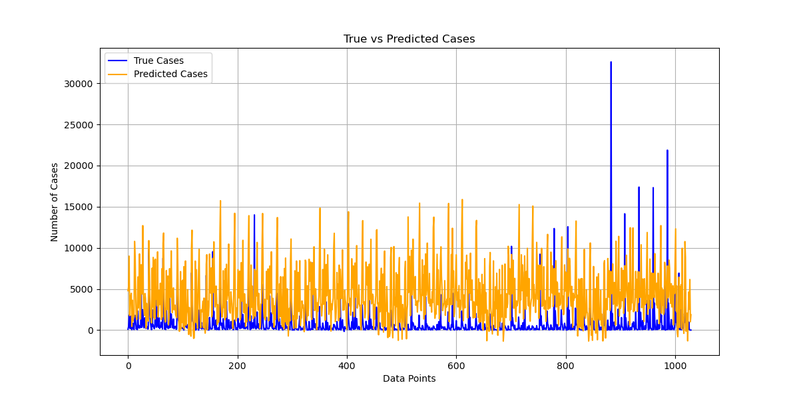
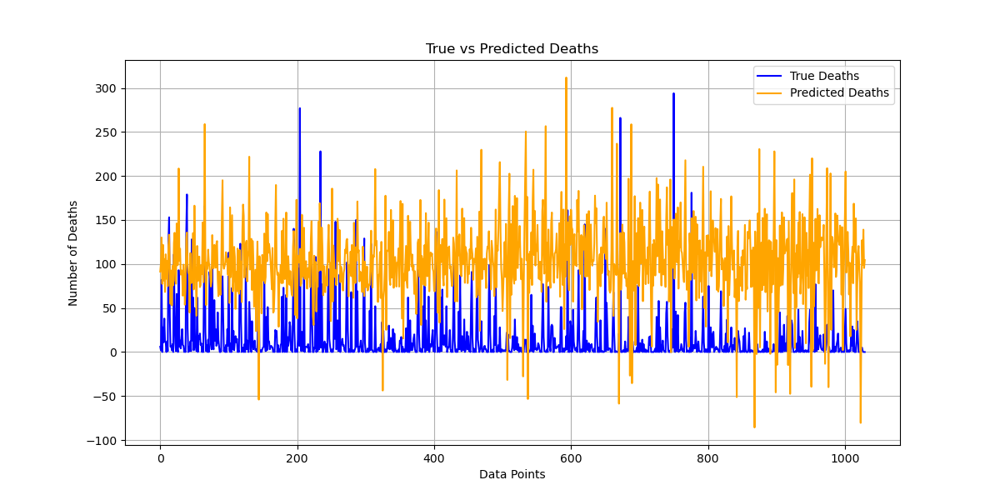
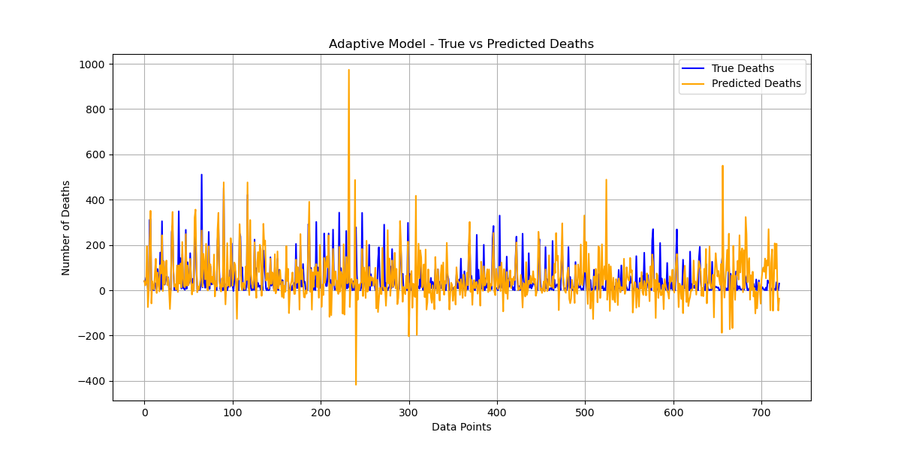

# AutoML-Powered Adaptive Drift Detection for COVID-19 Forecasting
 This project implements an AutoML-driven adaptive drift detection framework for COVID-19 forecasting, leveraging ADWIN & DDM to dynamically adjust models in response to concept drift. It enhances predictive accuracy by intelligently retraining models, ensuring robust time-series forecasting under evolving data conditions.

## Overview

This repository contains the implementation of an **AutoML-driven adaptive drift detection framework** for **COVID-19 forecasting**. The project leverages **AutoSklearn**, **ADWIN**, and **DDM** to dynamically adjust models in response to concept drift, ensuring robust time-series forecasting under evolving data conditions.

## Task / Problem Statement

### Main Problem:

The dynamic nature of COVID-19 data introduces **concept drift**, reducing the accuracy of static forecasting models. This project aims to enhance forecasting robustness by detecting and adapting to these shifts in real time.

### Objectives:

1. Develop a **baseline forecasting model** using AutoML to predict COVID-19 cases and deaths.
2. Implement an **adaptive forecasting model** that dynamically detects and reacts to drift.
3. Compare the performance of baseline and adaptive models.

## Goals & Sub-Goals

### Main Goals:

- Improve COVID-19 forecasting accuracy.
- Reduce the impact of concept drift on predictions.

### Sub-Goals:

- Integrate **ADWIN** and **DDM** for drift detection.
- Automate model retraining upon drift detection.
- Provide comparative performance metrics and visualizations.

## Implementation Details

### Code Structure:

1. **Data Preprocessing and Visualization**.
2. **Baseline Model Training** using Auto-Sklearn.
3. **Drift Detection Mechanism** (ADWIN, DDM).
4. **Baseline Model Evaluation**.
5. **Adaptive Model Training with Drift Response**.
6. **Adaptive Model Evaluation**.
7. **Comparative Analysis** between baseline and adaptive models.

### Algorithms & Mathematical Formulations:

1. **AutoML (AutoSklearn)**: Automates hyperparameter tuning and model selection.
2. **Drift Detection**:
   - **ADWIN** (Adaptive Windowing) detects drift by monitoring distribution changes.
   - **DDM** (Drift Detection Method) tracks error rates for drift detection.

#### Equations Used:

- **Mean Absolute Error (MAE):**
  \[ MAE = \frac{1}{n} \sum_{t=1}^{n} |y_t - \hat{y_t}| \]
- **Root Mean Squared Error (RMSE):**
  \[ RMSE = \sqrt{\frac{1}{n} \sum_{t=1}^{n} (y_t - \hat{y_t})^2} \]
- **R-squared (R²):**
  \[ R^2 = 1 - \frac{\sum_{t=1}^{n} (y_t - \hat{y_t})^2}{\sum_{t=1}^{n} (y_t - \bar{y})^2} \]

## Results & Metrics

### **Baseline Model Performance:**

| Metric | Cases   | Deaths |
| ------ | ------- | ------ |
| RMSE   | 4760.92 | 99.91  |
| MAE    | 3781.14 | 92.05  |
| R²     | -4.56   | -8.89  |

### **Adaptive Model Performance:**

| Metric | Cases   | Deaths |
| ------ | ------- | ------ |
| RMSE   | 3128.65 | 94.99  |
| MAE    | 1775.07 | 61.38  |
| R²     | 0.27    | -0.63  |

### **Drift Detection Results:**

| Drift Index | Model  | Detection Method |
| ----------- | ------ | ---------------- |
| 575         | Deaths | ADWIN            |
| 607         | Deaths | ADWIN            |
| 639         | Deaths | ADWIN            |

## Visualizations

### **Baseline Model Predictions:**




### **Adaptive Model Predictions:**




## How to Use

1. Clone the repository:

   ```bash
   git clone https://github.com/your-repo-name.git
   cd your-repo-name
   ```

2. Install dependencies:

   ```bash
   pip install -r requirements.txt
   ```

3. Run the Jupyter notebooks in sequence:

   ```bash
   jupyter notebook
   ```

4. View results and metrics in the `outputs/` directory.

## Future Work

- Experiment with additional drift detection algorithms.
- Optimize AutoML for larger datasets.
- Incorporate real-time data streams.

## References

- [AutoSklearn Documentation](https://automl.github.io/auto-sklearn/master/)
- [ADWIN - Adaptive Windowing](https://www.sciencedirect.com/science/article/pii/S0167865509001395)
- [DDM - Drift Detection Method](https://link.springer.com/article/10.1023/A:1022520821506)
- [COVID-19 Forecasting Methodologies](https://arxiv.org/abs/2004.11408)
- [Auto-ML COVID-19 Forecasting Research Paper](https://ieeexplore.ieee.org/document/9868791/)

